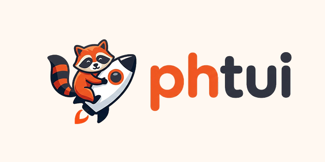

# phtui

Product Hunt TUI - browse the Product Hunt leaderboard from your terminal.




## Features

- Browse Daily / Weekly / Monthly leaderboards
- Browse by category (248 categories with search/filter)
- Clickable date navigation bar (mouse support)
- Product detail view with ratings, reviews, pros/cons, pricing, and links
- Open products in your browser with `o`
- Vim-style keyboard navigation
- Dracula color theme (16-color ANSI)
- In-memory caching for fast navigation

## Install

### Homebrew

```bash
brew install qyinm/tap/phtui
```

### Go

```bash
go install github.com/qyinm/phtui@latest
```

### Build from source

```bash
git clone https://github.com/qyinm/phtui.git
cd phtui
go build -o phtui .
./phtui
```

## Usage

```
phtui
```

### Key Bindings

| Key | Action |
|-----|--------|
| `j` / `k` | Navigate up/down |
| `Enter` | View product detail |
| `Esc` | Back to list |
| `Tab` | Cycle period (Daily/Weekly/Monthly/Categories) |
| `1` `2` `3` `4` | Switch to Daily/Weekly/Monthly/Categories |
| `h` / `l` | Previous/next date (or category) |
| `/` | Search (global product search, or filter categories) |
| `o` | Open in browser |
| `r` | Refresh |
| `?` | Toggle help |
| `q` | Quit |

Mouse clicks are supported on the period tabs and date bar.
Use `/` to open search input, type a query, then press `Enter` to run global search.
Press `4` or `Tab` to open the category selector, browse with `j`/`k`, and press `Enter` to view products. Use `/` to filter categories by name.

## Architecture

```
types/          Core types (Product, ProductDetail, ProductSource interface)
scraper/        HTTP scraper + HTML/SSR parser + cache
ui/             Bubbletea TUI (model, styles, keys, commands, delegate)
main.go         Entry point
```

Built with [Bubbletea](https://github.com/charmbracelet/bubbletea), [Bubbles](https://github.com/charmbracelet/bubbles), [Lipgloss](https://github.com/charmbracelet/lipgloss), and [goquery](https://github.com/PuerkitoBio/goquery).

## MCP Server

v1 is developer-friendly local mode only (stdio command). No hosted endpoint is required.

Core tools enabled by default (v1):

- `leaderboard_get`
- `product_get_detail`
- `category_list`
- `category_get_products`

Optional tools (off by default):

- `search_products` (`PHTUI_MCP_ENABLE_SEARCH=true`)
- `cache_clear` (`PHTUI_MCP_ENABLE_ADMIN=true`)

Local client setup examples:

One-command setup script:

```bash
./scripts/install-mcp-local.sh
```

Options:

```bash
./scripts/install-mcp-local.sh --codex-only
./scripts/install-mcp-local.sh --claude-only
./scripts/install-mcp-local.sh --name phtui-local
./scripts/install-mcp-local.sh --npx-cmd "npx -y @qyinm/phtui-mcp"
```

### Codex (local)

```bash
codex mcp remove phtui-local
codex mcp add phtui-local -- npx -y @qyinm/phtui-mcp
```

### Claude Code (local)

```bash
claude mcp add phtui-local -- npx -y @qyinm/phtui-mcp
```

### OpenCode (local)

Add this to your OpenCode config (`opencode.json` / `opencode.jsonc`):

```json
{
  "$schema": "https://opencode.ai/config.json",
  "mcp": {
    "phtui": {
      "type": "local",
      "command": ["npx", "-y", "@qyinm/phtui-mcp"],
      "enabled": true
    }
  }
}
```

### Development fallback (without npm publish)

```bash
go run ./cmd/phtui-mcp-stdio
```

Environment variables:

| Variable | Default | Description |
|---|---|---|
| `PHTUI_MCP_ENABLE_SEARCH` | `false` | Enable `search_products` tool |
| `PHTUI_MCP_ENABLE_ADMIN` | `false` | Enable admin tool `cache_clear` |
| `PHTUI_MCP_CACHE_CLEAR_INTERVAL` | `30m` | Periodic scraper cache clear; `0` disables |

## License

MIT
