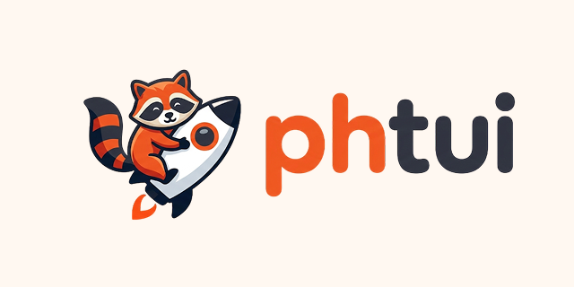

# phtui

Product Hunt-powered inspiration layer for agents building new services.

phtui turns Product Hunt launches, categories, and product details into structured idea context that agents can use for market scanning, feature inspiration, and MVP ideation.




## Features

- Browse Daily / Weekly / Monthly leaderboards
- Browse by category (248 categories with search/filter)
- Clickable date navigation bar (mouse support)
- Product detail view with ratings, reviews, pros/cons, pricing, and links
- Open products in your browser with `o`
- Vim-style keyboard navigation
- Dracula color theme (16-color ANSI)
- In-memory caching for fast navigation
- MCP tools for agent-readable Product Hunt context and inspiration bundles

## Install

### Homebrew

```bash
brew install qyinm/tap/phtui
```

### Go

```bash
go install github.com/qyinm/phtui@latest
```

### Build from source

```bash
git clone https://github.com/qyinm/phtui.git
cd phtui
go build -o phtui .
./phtui
```

## Usage

Interactive TUI:

```bash
phtui
```

Agent-friendly JSON CLI:

```bash
phtui ideas --category ai-agents --limit 5
phtui ideas --period daily --limit 5
phtui detail <product-slug>
phtui leaderboard --period weekly --limit 10
```

Use the CLI when an agent needs low-token Product Hunt context without loading MCP tools.

### Agent Skill

This repo ships an installable agent skill for the CLI workflow:

```bash
npx skills add qyinm/phtui --skill phtui-idea-pocket
```

List available skills before installing:

```bash
npx skills add qyinm/phtui --list
```

For local development:

```bash
npx skills add . --skill phtui-idea-pocket
```

### Key Bindings

| Key | Action |
|-----|--------|
| `j` / `k` | Navigate up/down |
| `Enter` | View product detail |
| `Esc` | Back to list |
| `Tab` | Cycle period (Daily/Weekly/Monthly/Categories) |
| `1` `2` `3` `4` | Switch to Daily/Weekly/Monthly/Categories |
| `h` / `l` | Previous/next date (or category) |
| `/` | Search (global product search, or filter categories) |
| `o` | Open in browser |
| `r` | Refresh |
| `?` | Toggle help |
| `q` | Quit |

Mouse clicks are supported on the period tabs and date bar.
Use `/` to open search input, type a query, then press `Enter` to run global search.
Press `4` or `Tab` to open the category selector, browse with `j`/`k`, and press `Enter` to view products. Use `/` to filter categories by name.

## Architecture

```
types/                 Core types and ProductSource interface
scraper/               Product Hunt HTTP scraper, HTML/SSR parsers, cache
ui/                    Bubbletea TUI model, rendering, keys, commands
mcpsrv/                MCP tool handlers, DTO conversion, middleware, config
cmd/phtui-mcp/         Streamable HTTP MCP server (/healthz, /mcp)
cmd/phtui-mcp-stdio/   Local stdio MCP server for desktop agent clients
npm/phtui-mcp/         npx launcher for the local stdio MCP server
main.go                TUI entry point
```

The TUI and MCP servers share the same `types.ProductSource` abstraction, so new data-source behavior should usually be added in `scraper/` first and then exposed through `ui/` and/or `mcpsrv/`.

Built with [Bubbletea](https://github.com/charmbracelet/bubbletea), [Bubbles](https://github.com/charmbracelet/bubbles), [Lipgloss](https://github.com/charmbracelet/lipgloss), [goquery](https://github.com/PuerkitoBio/goquery), and [modelcontextprotocol/go-sdk](https://github.com/modelcontextprotocol/go-sdk).

## MCP Server

v1 is developer-friendly local mode only. The recommended client path is the stdio command; the HTTP server is available for local development and health checks, but no hosted endpoint is required or documented as stable.

Core tools enabled by default (v1):

- `leaderboard_get`
- `product_get_detail`
- `category_list`
- `category_get_products`
- `idea_inspirations`

Optional tools (off by default):

- `search_products` (`PHTUI_MCP_ENABLE_SEARCH=true`)
- `cache_clear` (`PHTUI_MCP_ENABLE_ADMIN=true`)

Local client setup examples:

One-command setup script:

```bash
./scripts/install-mcp-local.sh
```

The `@qxinm/phtui-mcp` npm package is a lightweight launcher. It requires Go to be installed and available in `PATH`, then runs the stdio server with `go run`.

Options:

```bash
./scripts/install-mcp-local.sh --codex-only
./scripts/install-mcp-local.sh --claude-only
./scripts/install-mcp-local.sh --name phtui-local
./scripts/install-mcp-local.sh --npx-cmd "npx -y @qxinm/phtui-mcp"
```

### Codex (local)

```bash
codex mcp remove phtui-local
codex mcp add phtui-local -- npx -y @qxinm/phtui-mcp
```

### Claude Code (local)

```bash
claude mcp add phtui-local -- npx -y @qxinm/phtui-mcp
```

### OpenCode (local)

Add this to your OpenCode config (`opencode.json` / `opencode.jsonc`):

```json
{
  "$schema": "https://opencode.ai/config.json",
  "mcp": {
    "phtui": {
      "type": "local",
      "command": ["npx", "-y", "@qxinm/phtui-mcp"],
      "enabled": true
    }
  }
}
```

### Development fallback (without npm publish)

```bash
go run ./cmd/phtui-mcp-stdio
```

### Local smoke checks

Verify the MCP server exposes the default tool set:

```bash
go test ./mcpsrv -run TestMCPListTools -v
```

For the HTTP MCP server, check the health endpoint first:

```bash
go run ./cmd/phtui-mcp
curl -fsS http://localhost:8080/healthz
```

Environment variables:

| Variable | Default | Description |
|---|---|---|
| `PHTUI_MCP_ENABLE_SEARCH` | `false` | Enable `search_products` tool |
| `PHTUI_MCP_ENABLE_ADMIN` | `false` | Enable admin tool `cache_clear` |
| `PHTUI_MCP_CACHE_CLEAR_INTERVAL` | `30m` | Periodic scraper cache clear; `0` disables |

## License

MIT
